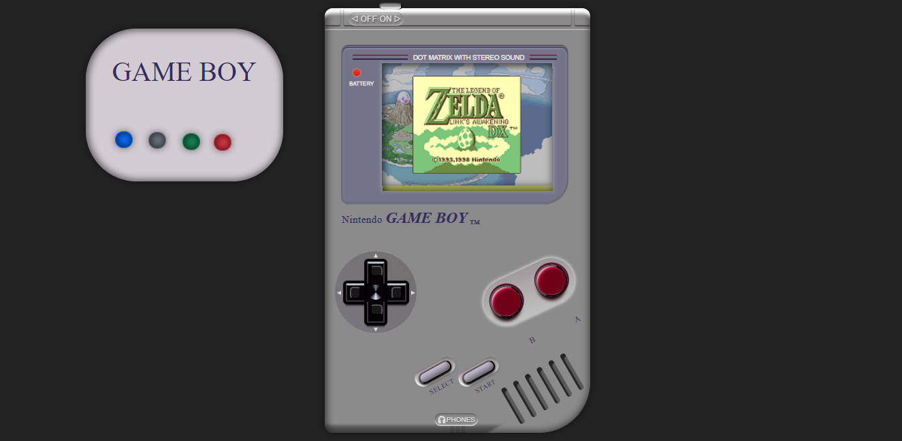
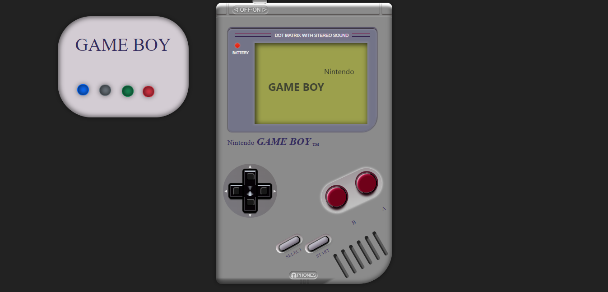
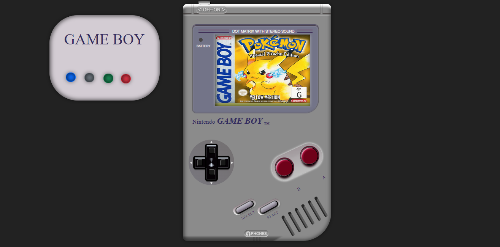
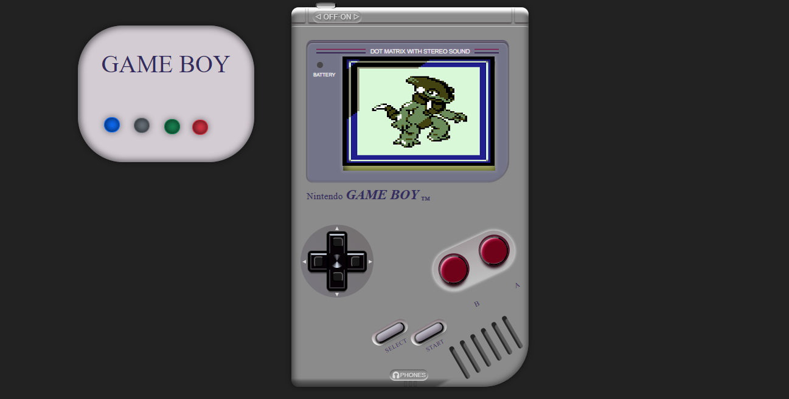
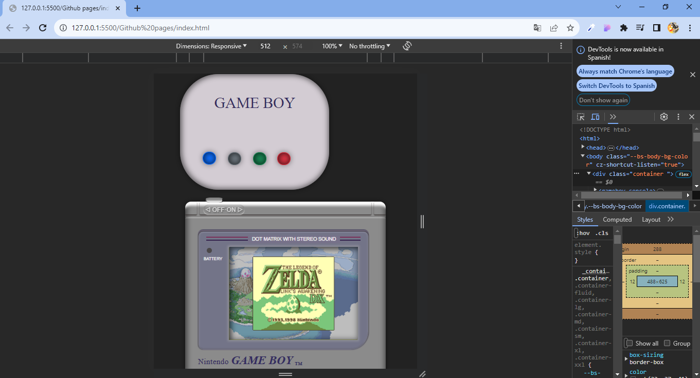

# PROYECTO 2 GAMEBOY 🎮


En este segundo proyecto, nos proponemos recrear la interfaz frontal de una consola de videojuegos, ya sea portátil o de sobremesa, sin limitaciones respecto a la marca o la época. Nuestro objetivo principal es aplicar los conocimientos adquiridos en JavaScript y DOM/BOM para conferir dinamismo a la interfaz de la consola.

La aplicación desarrollada permitirá cambiar la imagen en pantalla mediante la interacción con botones gráficos representativos de la consola. Se espera la implementación de un cambio mínimo de tres imágenes, y se contará con funciones de reseteo que restaurarán la imagen inicial y de encendido/apagado para controlar el sistema.

Este proyecto se presenta como una oportunidad para aplicar conceptos avanzados de programación web, explorando el potencial de la interactividad en una interfaz de usuario, y demuestra nuestra capacidad para integrar conceptos teóricos en soluciones prácticas y funcionales.

## Tabla de Contenidos 🗒️
- [Tecnologias](#capturas-de-pantalla)
- [Capturas de Pantalla](#capturas-de-pantalla)
- [Instalación](#instalación)
- [Uso](#uso)
- [Ejemplos](#ejemplos)
- [Contribución](#contribución)
- [Desarrollo Local](#desarrollo-local)
- [Licencia](#licencia)
- [Contacto](#contacto)
##Tecnoglogias 💻
Basándome en el código y las instrucciones proporcionadas, parece que has utilizado las siguientes tecnologías en tu proyecto de Game Boy Web Console:


## Tecnologias 💻
Basándome en el código y las instrucciones proporcionadas, parece que has utilizado las siguientes tecnologías en tu proyecto de Game Boy Web Console:


1. HTML: Para la estructura y contenido de tu página web.

2. CSS: Para el diseño y estilo de tus elementos HTML.

3. JavaScript (Vanilla): Para la interactividad de la consola Game Boy. Has utilizado JavaScript para manipular el DOM (Document Object Model) y gestionar eventos como clics en botones.

4. GitHub: Para alojar y versionar tu proyecto.

5. Markdown: Para la documentación de tu proyecto en GitHub.

Estas tecnologías son comunes en el desarrollo web y han sido utilizadas para crear una interfaz de consola Game Boy con botones y pantallas que responden a eventos de clic. Además, has aplicado estilos específicos para darle una apariencia visual atractiva.
## Capturas de Pantalla 📸
inicio

Pulsando el Boton power switch

Pulsando el Boton azul

Pulsando el Boton gris

Pulsando el Boton verde

Pulsando el Boton rojo te lleva la imagen inicial

RESPONSIVE 100%


## Instalación ⚙️
No se requiere una instalación especial para utilizar la Game Boy Web Console en tu sitio web. Solo necesitas incluir los archivos JavaScript y CSS en tu proyecto.


## Uso 📌
Para utilizar la consola Game Boy web, simplemente incorpora el componente principal `<gameboy-console></gameboy-console>` en tu archivo HTML. Además, puedes agregar otros componentes específicos según tus necesidades.


## Ejemplos
### Uso básico 

```html
<!DOCTYPE html>
<html lang="en">
<head>
    <meta charset="UTF-8">
    <meta name="viewport" content="width=device-width, initial-scale=1.0">
    <title>Game Boy Web Console</title>
</head>
<body>
    <gameboy-console></gameboy-console>
</body>
</html>

```
### Agregar botones y pantalla 
```html
<!DOCTYPE html>
<html lang="en">
<head>
    <meta charset="UTF-8">
    <meta name="viewport" content="width=device-width, initial-scale=1.0">
    <title>Game Boy Web Console</title>
</head>
<body>
    <gameboy-console>
        <gameboy-button name="A"></gameboy-button>
        <gameboy-button name="B"></gameboy-button>
        <gameboy-screen></gameboy-screen>
    </gameboy-console>
</body>
</html>
```
## Contribución 💬
Este proyecto es un ejercicio creativo y de diseño. Siéntete libre de contribuir, hacer sugerencias o realizar mejoras. ¡Diviértete experimentando con la apariencia de la consola Game Boy en la web!


## Desarrollo Local 🔨
Si deseas contribuir o realizar modificaciones locales al proyecto, sigue estos pasos:
1. Clona este repositorio:
```
  git clone https://github.com/Jahirtoloza14/Proyecto2.git
```
2.Abre el proyecto en tu editor de código favorito.
3.Realiza las modificaciones o contribuciones deseadas en los archivos .js y .css. 
4. Para ver tus cambios localmente, simplemente abre el archivo HTML en un navegador.
## Licencia 💳

Este proyecto está bajo la licencia MIT. Ver el archivo   para más detalles.

## Contacto 📞


Este proyecto está bajo la licencia MIT. Ver el archivo   para más detalles.


